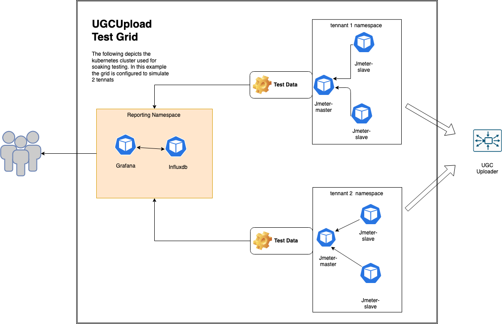

# Distributed Jmeter Test Rig Using Kubernettes


Table of Contents
=================

  - [Introduction](#introduction)
    + [Jmeter Test Creation Process](#jmeter--test--creation)
    + [Running Tests](#running--tests)
    + [Generate Jmeter Report](#generate--jmeter--report)
  - [Dependencies](#dependencies)
    + [Prerequisite](#prerequisite)  
  - [Create Test Rig Cluster](#create--test--rig--cluster)
  - [Containerize And Upload to ECR(AWS Docker Repo)](#containerize--and--upload--to--ecr)
  - [Provision Test Rig](#provision--test--rig)
    + [Create Reporting Virtual Cluster](#create--reporting--virtual--cluster)
       + [Acccess Grafana Dashboard](#acccess--grafana--dashboard)
       + [Install Jmeter Dashboard](#install--jmeter--dashboard)
    + [Add Tennant To Cluster](#add--tennant--to--cluster)
  - [Monitor Cluster](#monitor-cluster)
    + [View In Browser](#view--in--browser)
    


# Introduction

UGCUploader is a multi-tenant application. In which each tennent has a different usage profile.

The purpose of the Test Rig is to emulate the interaction that occurs when multiple tennants are using the system. In order to achieve this, each tennant will be associated with a namespace. Within this namespace a distributed Jmeter test will be deployed that runs a test specific for that tennant.

Once the test completes the results are uploaded to an s3 bucket *ugcupload-jmeter* 

The diagram below depicts the scenario when 2 tenants are being simulated.

# 


## Jmeter Test Creation

The following is the process that should be followed to create test and deploy to the cluster.

1. Create test. 
   + Test should be stored in the folder `src/test`
2. Containerize the test by re-building the *master* jmeter image. Follow the instructions outlined here [Containerize And Upload to ECR(AWS Docker Repo)](#containerize--and--upload--to--ecr)
3. Provision tennant: If tennant is already provisioned undo first: Follow instructions outlined here  [#Add Tennant To Cluster](#add--tennant--to--cluster)


## Running Tests

The following scripts can be found in the folder *test-scripts*

1. Starting a Test for a Tennant

   *start_test <path-to-test> <tennent>*<br>

   Eg.  ```./test-scripts/start_test ugcupload/upload.jmx children```

2. Stop Test for a Tenant <br> *stop_test <tennent>*<br> Eg. ```./test-scripts/stop_test children```


## Generate Jmeter Report

The test artefacts are stored in s3 bucket 

Use the following command to convert  to jmeter report.

```$JMETER_HOME/bin/jmeter -g resutls.jtl -o <report-folder>``

# Dependencies

1. EKSCTL: https://eksctl.io/introduction/installation/ <br>This is used to create and manipulate the cluster
2. KUBECTL: https://kubernetes.io/docs/tasks/tools/install-kubectl/#install-kubectl-on-macos <br>Used to provision and orchestrate kubernetes.
3. Docker: https://docs.docker.com/install/ <br>Used to push images to the ECR repository.
4. AWS I am authenticator: https://docs.aws.amazon.com/eks/latest/userguide/install-aws-iam-authenticator.html

## Prerequisite

### Tooling

The *eksctl* tool does not work with *~/.aws/credential* file.

The following modifications were done to fetch-aws-creds:

```

with open(home + '/workspace/isite-testing-tools/jmeter/ugc/kubernetes/setup-aws-env.sh', 'w') as f:
    f.write('export AWS_ACCESS_KEY_ID={accessKeyId}\n'.format(**creds))
    f.write('export AWS_SECRET_ACCESS_KEY={secretAccessKey}\n'.format(**creds))
    f.write('export AWS_SESSION_TOKEN={sessionToken}\n'.format(**creds))
    f.write('export PATH=$PATH:~/Library/Python/3.7/bin\n')

st = os.stat(home + '/workspace/setup-aws-env.sh')
os.chmod(home + '/workspace/setup-aws-env.sh', st.st_mode | stat.S_IEXEC)
```

Following command can then be issued to set the AWS environmental variables.

**source  ~/workspace/setup-aws-env.s**


# Create Test Rig Cluster

The document in this link [CreateCluster](#CreateClusterSteps.md) outlines the steps for creating the cluster.


# Containerize And Upload to ECR

Before you can deploy to the ECR repository you will need to login.

The following command can be used to get the docker login command:

**aws ecr get-login --no-include-email --region eu-west-2 | sed 's|https://||'**

In the folder **docker** There are three sub folders **base**, **master** and **slave**

In each of these sub folders run the command:  *deploy.sh <aws-account-number> <aws-region>* 

Eg.`deploy.sh 546933502184 eu-west-2`

### Building JMETER base Image:

This is located in `docker/base`.

If your test utilises any plugins the corresponding jar(s) should be put in the folder *plugins*


# Provision Test Rig

## Create Reporting Virtual Cluster

In the folder *kubernetes-artefacts/reporter* 

There are two scripts:

1. *create-report-env.sh* Used to create the reporting virtual environmnt in the cluster. <br> Usage:  `create-report-env.sh <aws-account-number>`  eg. *./create-report-env.sh 546933502184* <br>Used the following to command to verify that the instances have succesfully started before moving to the next step. `kubectl get pods --all-namespaces`
2. *configure-reporting.sh* Used to setup grafana and influxes. <br> Usage: `./configure-reporting.sh` <br> If you see the following error. It is safe to ignore<br>```wget: can't open 'datasources': Permission denied
   command terminated with exit code 1```
3. *un-do.sh* Used to remove the reporting virtual environment from the cluster.<br>NOTE: Currently the PVC( Persistent Volume Claim) is also removed, which causes the associated volume to be also deleted.

The table below details the steps performed by the script to create the virtual environment.

| Step | Objective                                  | Description                                                  | Action                                                       |
| ---- | ------------------------------------------ | ------------------------------------------------------------ | ------------------------------------------------------------ |
| 1    | create reporting namespace                 | This is the namespace use                                    | *kubectl create namespace ugcload-reporter*                  |
| 2    | Add ServiceAccount to the virtual cluster. | Is to give pods in the virtual cluster access to aws resources. The policy Arn is the one created when setting up the cluster. | *eksctl create iamserviceaccount --name ugcupload-jmeter --namespace ugcload-reporter   --cluster ugcloadtest --attach-policy-arn arn:aws:iam::546933502184:policy/ugcupload-eks-jmeter-policy --approve --override-existing-serviceaccounts* |
| 3    | Install lnfluxdb                           | This is used to collect time series data from the test       | *kubectl create -n ugcload-reporter -f influxdb.yaml*        |
| 4    | Install Grafana                            | This the dashboard used to get insight about running tests.  | *Kubectl create -n ugcload-jmeter -f grafana.yaml*           |


### Acccess Grafana Dashboard

The instance has been configured to map to the load balancer.

The following command can be used to get the url:`kubectl get services --namespace=ugcload-reporter`

This will return the following:

| NAME           | TYPE         | CLUSTER-IP    | EXTERNAL-IP                                                  | PORT(S)        | AGE  |
| -------------- | ------------ | ------------- | ------------------------------------------------------------ | -------------- | ---- |
| jmeter-grafana | LoadBalancer | 10.100.244.16 | a708e1018287211ea905d060265a2432-970821218.eu-west-2.elb.amazonaws.com | 3000:30158/TCP | 27m  |

From the example above the following URL can be used to access the dashboard.

http://a708e1018287211ea905d060265a2432-970821218.eu-west-2.elb.amazonaws.com:3000

### Install Jmeter Dashboard

Below is the dashboard used to visualise the results.

https://grafana.com/grafana/dashboards/1152 


## Add Tennant To Cluster

In the folder *kubernetes-artefacts/tennant* There file *add-tennat-to-cluster.sh* can be used to add a tenant's test environment to the cluster. Usage: `add-tennat-to-cluster.sh <namespace> <aws_account_number> <aws_region>`

eg. *./add-tennat-to-cluster.sh one 546933502184 eu-west-2*

The file `un-do.sh` can be used to remove the tennant from the cluster.

Eg. *./un-do.sh one*


# Monitor Cluster

https://www.weave.works/docs/scope/latest/installing/#k8s This is used to monitor the state of the cluster.

Run the script *install-weavescope.sh* which can be found in *kubernetes-util* folder


## View In Browser

To view the state of the cluster within a browser run the script *proxy-forward-weavescope.sh* which can be found in *kubernetes-util* folder

You can then view the cluster using: http://127.0.0.1:4040